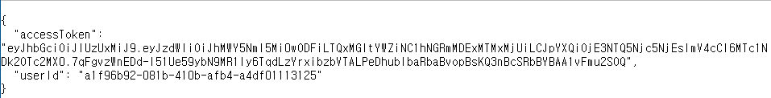
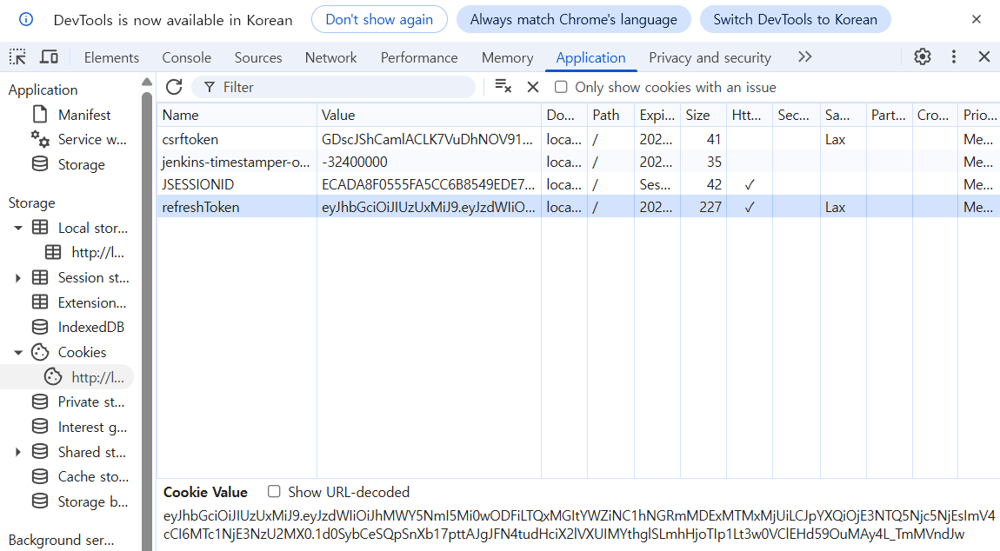
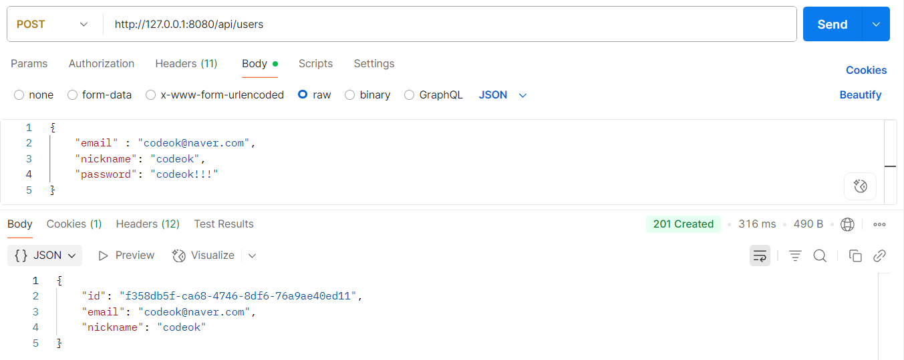
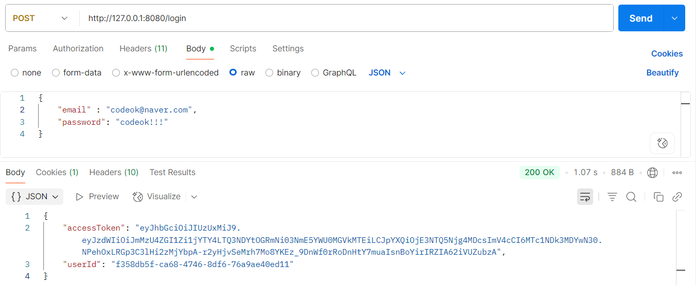
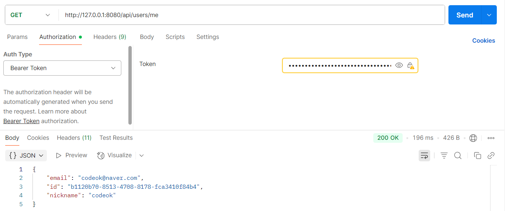
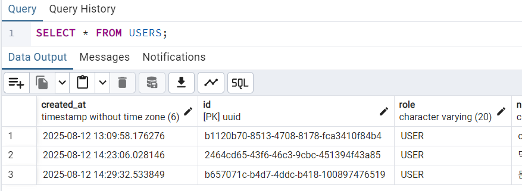
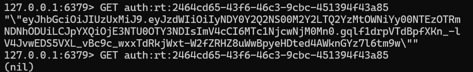
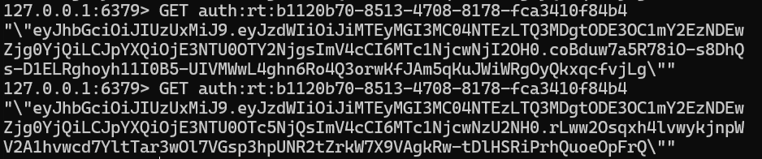
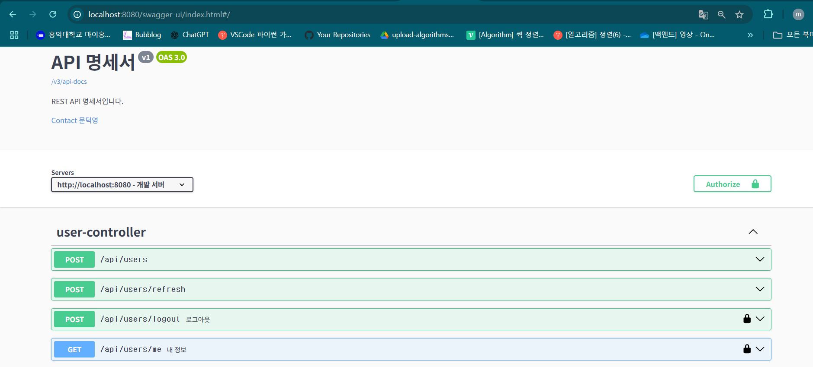

# ✍🏻 레포지토리의 주 목적 : JUni5를 활용한 단위테스트와 통합테스트를 학습
1. 프로젝트의 요구사항에 맞게 먼저 서비스 코드를 작성 (즉, TDD 방식은 아님‼️)
2. 작성된 서비스 코드를 가장 작은 단위로 나누어 메소드 별로 단위 테스트를 진행
3. 단위 테스트가 성공한 후, 연관된 모듈/클래스 간의 통합 테스트 진행

위 작업을 기반으로 JUnit5에 보다 익숙해지고 적절한 테스트 코드를 작성하는 역량을 기르기 위함.

---

### 😊 요구사항 및 구현 내용
- Spring Security를 활용하여 인증/인가 시스템 구현
- OAuth-Client를 활용해 Google/Kakao OAuth 로그인 API 구현
- 일반 로그인도 허용
- REST API를 설계할 것
- Swagger 기반 API 자동 문서화
- Redis에 리프레시 토큰 보관 및 관리
- 사용자 정보 조회

---

### ⭐ 진행한 단위 테스트
- CustomOAuth2UserService 코드 (신규 회원인 경우 회원가입, 기존 회원인 경우 로그인, 지원하지 않는 소셜 로그인 예외 처리)
- UserService 코드 (일반 회원가입, 토큰 재발행, 사용자 정보 조회, 로그아웃)
- JwtUtil 코드 (액세스/리프레시 토큰 생성, 토큰 검증, 사용자ID 추출)

---
### 🔧 기술 스택
| 구분      | 기술                                      |
|-----------|-------------------------------------------|
| Backend   | Java 17, Spring Boot                      |
| DB        | PostgreSQL, JPA, Redis                           |
| Auth      | Spring Security, OAuth-Client, jjwt       |
| OAuth API | Google, Kakao                             |
| Test      | JUnit5, Mockito, AssertJ                   |

---

### 💪🏻 API 동작 방식 및 실제 API 테스트
1️⃣ **OAuth 로그인 방식** :  [GET요청] localhost:8080/oauth2/authorization/{registrationId}  
registrationId은 kakao 또는 google  
2️⃣ **일반 로그인 방식** :  [GET요청] localhost:8080/login  

**API 테스트**

  
📷 브라우저 테스트

    
  로그인 성공 후 액세스 토큰을 응답으로 받음

    
  리프레시 토큰은 HttpOnly 쿠키로 받음

  
📷 포스트맨 테스트

    
  일반 로그인 회원가입

    
  일반 로그인

    
  유저 정보 조회

  
📷 DB 확인

    
  DB에서 유저 테이블 조회

  
📷 Redis 리프레시 토큰 확인

    
  로그아웃 시 Redis에서 토큰 삭제 성공

    
  토큰 재발행 시 Redis에 있는 기존 리프레시 토큰 갱신 성공

  
📷 스웨거 연동 (API 명세서)

    
  스웨거 명세서 UI

---

### 📖 스터디 방식
- 유튜브 강의
- Claude AI 활용
- 기술 블로그 활용

### 📝 스터디 하면서 작성한 기술 블로그
[단위테스트 테스트 코드 작성](https://velog.io/@mdy3722/Junit5%EC%99%80-AssertJ%EB%A5%BC-%ED%99%9C%EC%9A%A9%ED%95%98%EC%97%AC-%EB%8B%A8%EC%9C%84%ED%85%8C%EC%8A%A4%ED%8A%B8%EB%A5%BC-%EC%A7%84%ED%96%89)  
[Mockito.Spy() 잘못된 사용으로 인한 문제 발생과 해결](https://velog.io/@mdy3722/%EC%9E%98%EB%AA%BB%EB%90%9C-Spy-%EC%82%AC%EC%9A%A9%EC%9D%B4-%EB%B6%80%EB%A5%B8-%ED%85%8C%EC%8A%A4%ED%8A%B8-%EC%8B%A4%ED%8C%A8)

